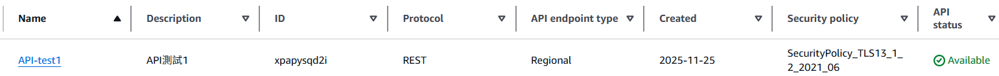
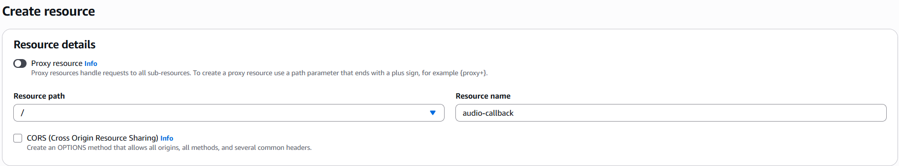
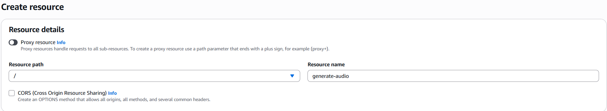
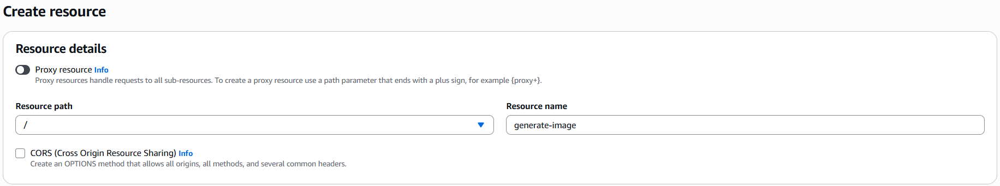
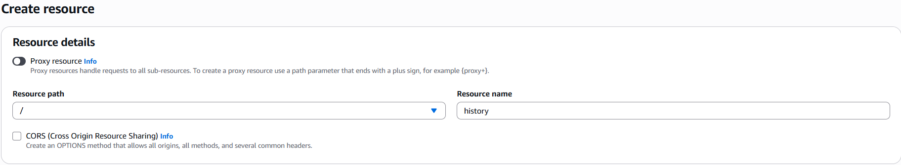
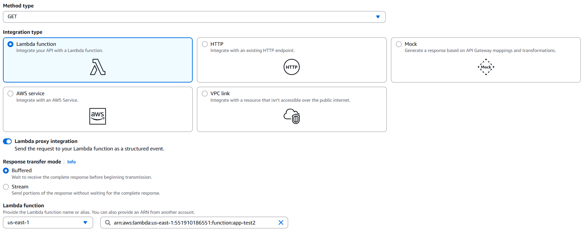

# 開啟環境
```
docker run -it --rm -v "C:\Users\Neo Yeh\Desktop\雲端實務\FinalProject\backend\src:/app" discord-bot
```
# S3 設定
<div style="background-color: #fff3cd; border-left: 4px solid #ffc107; padding: 12px; margin: 15px 0;">
<p style="color: #856404; margin: 0;">
<strong style="color: #ff6b35;">⚠️ Caution:</strong> bucketname 要改，app.py 內有關 bucket name 的都要改，因為要全球唯一
</p>
</div>

1. 建立 bucket
```
aws s3api create-bucket \
  --bucket <bucketname> \
  --region ap-northeast-1 \
```
2. 關掉 Block all public access (因為要允許外部存取)
```
aws s3api put-public-access-block \
  --bucket <bucketname> \
  --public-access-block-configuration \
  BlockPublicAcls=false,IgnorePublicAcls=false,BlockPublicPolicy=false,RestrictPublicBuckets=false
```
3. 設定 Bucket Policy (唯讀)
- 先把 json 檔掛上雲端
```
nano bucket-policy.json
```
- 再設定 policy
```
aws s3api put-bucket-policy \
  --bucket <bucketname> \
  --policy file://bucket-policy.json
```

4. 建立資料夾 Images & Audios
```
aws s3api put-object \
  --bucket <bucketname> \
  --key Images/

aws s3api put-object \
  --bucket <bucketname> \
  --key Audios/
```

# DynamoDB 設定
```
aws dynamodb create-table \
  --table-name UserRecords \
  --attribute-definitions \
      AttributeName=user_id,AttributeType=S \
      AttributeName=record_id,AttributeType=S \
  --key-schema \
      AttributeName=user_id,KeyType=HASH \
      AttributeName=record_id,KeyType=RANGE \
  --billing-mode PAY_PER_REQUEST \
  --region us-east-1
```
# API Gateway 設定
1. 建立 API

2. 建立 Resource
- audio-callback

- generate-audio

- generate-image

- history

3. 建立 method
- audio-callback, generate-audio, generate-image

- history
