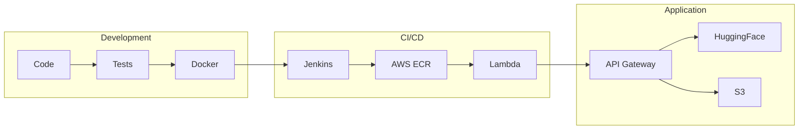

# AWS Final Project

A comprehensive cloud computing project combining an **AI Generation Application** with a complete **CI/CD Pipeline** for automated deployment to AWS Lambda.

## Project Overview

This project demonstrates two key components:

### 1. AI Generation Application
A Flask-based REST API providing AI-powered content generation:
- **Image Generation** - HuggingFace Stable Diffusion XL
- **Music Generation** - Suno API (async)
- **File Storage** - AWS S3 with presigned URLs
- **History Tracking** - AWS DynamoDB

### 2. CI/CD Pipeline
Automated deployment from local development to AWS:
- **Jenkins Automation** - CI/CD pipeline with GitHub webhooks
- **Docker Containers** - Lambda-compatible images
- **AWS SAM** - Infrastructure as Code
- **Branch Strategy** - Development (Jeffery) vs Production

## Architecture



## Tech Stack

| Category | Technologies |
|----------|--------------|
| **Backend** | Python 3.11, Flask 3.0, Gunicorn |
| **AI APIs** | HuggingFace SDXL, Suno |
| **AWS** | Lambda, API Gateway, ECR, S3, DynamoDB |
| **CI/CD** | Jenkins, Docker, SAM |
| **Testing** | pytest |

## Quick Start

```bash
# 1. Setup
cd backend
python3.11 -m venv .venv
source .venv/bin/activate
pip install -r requirements.txt

# 2. Test
./scripts/local/test-local.sh --prod

# 3. Build
./scripts/local/build-local.sh --prod

# 4. Run locally
docker run --rm -p 8000:8000 --env-file .env aws-lab-flask-demo:local
curl http://localhost:8000/health
```

See [docs/QUICK_START.md](docs/QUICK_START.md) for complete setup instructions.

## Documentation

| Document | Description |
|----------|-------------|
| [QUICK_START.md](docs/QUICK_START.md) | Get started in 5 minutes |
| [ARCHITECTURE.md](docs/ARCHITECTURE.md) | System diagrams |
| [APPLICATION.md](docs/APPLICATION.md) | Backend API documentation |
| [CI_CD.md](docs/CI_CD.md) | Pipeline setup and usage |
| [TESTING.md](docs/TESTING.md) | Testing guide |
| [SCRIPTS.md](docs/SCRIPTS.md) | Script reference |
| [CONTRIBUTING.md](docs/CONTRIBUTING.md) | How to contribute |
| [TROUBLESHOOTING.md](docs/TROUBLESHOOTING.md) | Common issues |

## Project Structure

```
AWS_final_project/
├── backend/                 # Production AI backend
├── demo-backend/            # CI/CD validation backend
├── jenkins-pipeline-setting/ # Jenkinsfiles
├── aws/                     # SAM templates
├── scripts/                 # Automation scripts
│   ├── local/              # Local testing
│   └── jenkins/            # CI/CD scripts
├── docs/                    # Documentation
└── specs/                   # Design documents
```

## API Endpoints

| Endpoint | Method | Description |
|----------|--------|-------------|
| `/health` | GET | Health check |
| `/generate-image` | POST | Generate AI image |
| `/generate-audio` | POST | Generate AI music |
| `/history` | GET | User history |

## Development Workflow

```bash
# Daily development
git checkout Jeffery
./scripts/local/test-local.sh --prod
git add . && git commit -m "feat: description"
git push origin Jeffery
# Jenkins CI runs automatically
```

## CI/CD Philosophy

**Prove → Codify → Automate**

1. Test manually with scripts
2. Write Jenkinsfiles
3. Enable webhooks

See [docs/CI_CD.md](docs/CI_CD.md) for details.

## License

Educational project for cloud computing demonstration.

---

**Tech Stack:** Python | Flask | Docker | Jenkins | AWS Lambda | SAM
