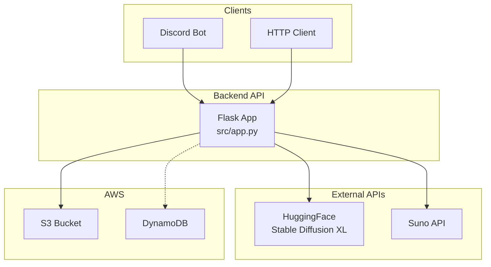
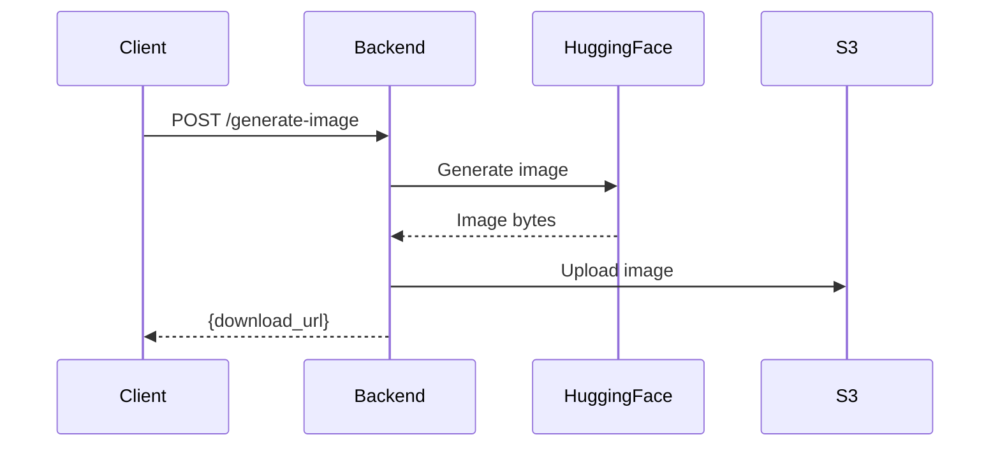
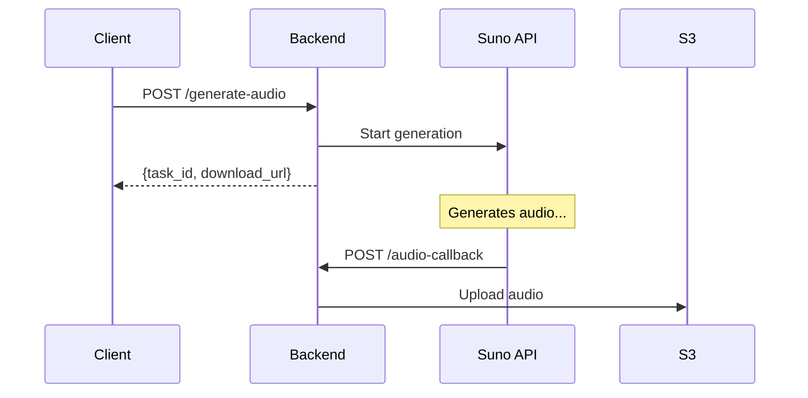

# Application Documentation

The AI Generation Backend - a Flask-based REST API providing AI-powered image and music generation.

## Table of Contents

- [Overview](#overview)
- [Architecture](#architecture)
- [API Endpoints](#api-endpoints)
- [Environment Configuration](#environment-configuration)
- [Local Development](#local-development)
- [Directory Structure](#directory-structure)
- [Design Decisions](#design-decisions)
- [Challenges and Solutions](#challenges-and-solutions)

---

## Overview

The production backend integrates AI generation capabilities:

- **Image Generation** - HuggingFace Stable Diffusion XL
- **Music Generation** - Suno API (async with webhooks)
- **File Storage** - AWS S3 with presigned URLs
- **History Tracking** - AWS DynamoDB (optional)

### Key Features

| Feature | Status | Description |
|---------|--------|-------------|
| REST API | Flask 3.0.0 + Gunicorn | Production-ready WSGI server |
| Image Generation | HuggingFace SDXL | ~10-15 seconds per image |
| Audio Generation | Suno API | Async with webhook callback |
| File Storage | AWS S3 | Presigned URLs (1-hour expiry) |
| History | DynamoDB | Optional - fails gracefully |
| Testing | pytest | 17 tests (12 unit + 5 integration) |

---

## Architecture

### System Diagram



### Data Flow: Image Generation



### Data Flow: Audio Generation (Async)



---

## API Endpoints

### GET /health

Health check endpoint.

**Response:**
```json
{
  "status": "ok",
  "service": "production-backend"
}
```

### POST /generate-image

Generate AI images using text prompts.

**Request:**
```json
{
  "prompt": "a beautiful sunset over mountains",
  "user_id": "user123"
}
```

**Response:**
```json
{
  "success": true,
  "download_url": "https://bucket.s3.amazonaws.com/Images/...",
  "reply": "Flask received image prompt: ..."
}
```

**Error Responses:**
- `400` - Missing or invalid prompt
- `500` - API error, S3 upload failed

### POST /generate-audio

Generate AI music (async).

**Request:**
```json
{
  "prompt": "relaxing piano music",
  "user_id": "user123"
}
```

**Response:**
```json
{
  "success": true,
  "task_id": "...",
  "download_url": "https://bucket.s3.amazonaws.com/Audios/...",
  "message": "Music generation started"
}
```

### POST /audio-callback

Webhook endpoint for Suno API completion (internal use).

### GET /history?user_id=xxx

Retrieve generation history for a user.

**Response:**
```json
{
  "success": true,
  "records": [
    {
      "prompt": "...",
      "file_url": "https://...",
      "type": "image"
    }
  ]
}
```

---

## Environment Configuration

Create `backend/.env`:

```bash
# AWS Credentials (from AWS Learner Lab)
AWS_ACCESS_KEY_ID=ASIA...
AWS_SECRET_ACCESS_KEY=...
AWS_SESSION_TOKEN=...
AWS_DEFAULT_REGION=us-east-1

# AWS Resources
S3_BUCKET_NAME=your-bucket-name
DYNAMODB_TABLE=UserRecords

# AI API Tokens
HUGGINGFACE_TOKEN=hf_...
SUNO_TOKEN=...

# Optional: Discord Bot
DISCORD_TOKEN=...
API_GATEWAY_URL=http://localhost:8000
```

### Environment Variables Reference

| Variable | Required | Description |
|----------|----------|-------------|
| `AWS_ACCESS_KEY_ID` | Yes | AWS authentication |
| `AWS_SECRET_ACCESS_KEY` | Yes | AWS authentication |
| `AWS_SESSION_TOKEN` | Yes | AWS temporary credentials |
| `AWS_DEFAULT_REGION` | Yes | AWS region (us-east-1) |
| `S3_BUCKET_NAME` | Yes | S3 bucket for files |
| `HUGGINGFACE_TOKEN` | Yes | HuggingFace API token |
| `DYNAMODB_TABLE` | No | DynamoDB table name |
| `SUNO_TOKEN` | No | Suno API token |

---

## Local Development

### Setup

```bash
cd backend
python3.11 -m venv .venv
source .venv/bin/activate
pip install -r requirements.txt
```

### Run Locally

```bash
# Using Flask dev server
python src/app.py

# Using Gunicorn (production-like)
gunicorn --bind 0.0.0.0:8000 src.app:create_app()
```

### Run with Docker

```bash
# Build image
docker build -t aws-lab-flask-demo:local .

# Run container
docker run -d --name flask-test -p 8000:8000 --env-file .env aws-lab-flask-demo:local

# View logs
docker logs flask-test -f

# Stop and remove
docker stop flask-test && docker rm flask-test
```

### Test API

```bash
# Health check
curl http://localhost:8000/health

# Generate image
curl -X POST http://localhost:8000/generate-image \
  -H "Content-Type: application/json" \
  -d '{"prompt":"a cute cat","user_id":"test"}'
```

---

## Directory Structure

```
backend/
├── src/
│   ├── app.py              # Main Flask application (449 lines)
│   └── db.py               # DynamoDB helpers (69 lines)
├── tests/
│   ├── unit/               # 12 unit tests
│   │   ├── test_health.py
│   │   ├── test_generate_image.py
│   │   └── test_generate_audio.py
│   └── integration/        # 5 integration tests
│       └── test_api.py
├── Dockerfile              # Lambda-compatible container
├── requirements.txt        # Python dependencies
├── .env                    # Environment variables (not in git)
└── README.md               # Brief overview
```

### Core Files

| File | Lines | Description |
|------|-------|-------------|
| `src/app.py` | ~450 | Flask app with all endpoints |
| `src/db.py` | ~70 | DynamoDB helper functions |
| `Dockerfile` | ~20 | Lambda Web Adapter container |
| `requirements.txt` | ~10 | Python dependencies |

---

## Design Decisions

### 1. Application Factory Pattern

**Decision:** Use `create_app()` factory function.

**Rationale:**
- Enables testing with different configurations
- Supports multiple instances
- Better separation of concerns

```python
def create_app(config=None):
    app = Flask(__name__)
    # Configure app
    register_routes(app)
    return app
```

### 2. Non-Fatal DynamoDB

**Decision:** DynamoDB errors don't fail image/audio generation.

**Rationale:**
- Core functionality (AI generation) works without history
- Better UX - users get their images even if tracking fails
- DynamoDB table may not exist in all environments

```python
try:
    insert_record(user_id, prompt, url)
except Exception as e:
    logger.warning(f"DynamoDB insert failed: {e}")
    # Continue - don't fail the request
```

### 3. Presigned URLs

**Decision:** Use S3 presigned URLs with 1-hour expiry.

**Rationale:**
- No direct S3 access needed for clients
- Time-limited for security
- Works with private S3 buckets

### 4. Async Audio Generation

**Decision:** Audio uses webhook callback pattern.

**Rationale:**
- Suno API takes 1-2 minutes to generate
- Don't block HTTP request for that long
- Return immediately with task ID
- Callback updates S3 when ready

### 5. 300-Second Docker Timeout

**Decision:** Gunicorn timeout set to 300 seconds.

**Rationale:**
- AI API calls can be slow
- Default 30s timeout caused failures
- 5 minutes covers worst-case scenarios

---

## Challenges and Solutions

### Challenge 1: AWS Credentials Expire

**Problem:** Learner Lab credentials expire every 3-4 hours.

**Solution:**
- Update `backend/.env` with new credentials
- Recreate Docker container (restart not enough)
- Document in troubleshooting guide

```bash
docker stop flask-test && docker rm flask-test
docker run -d --name flask-test -p 8000:8000 --env-file .env aws-lab-flask-demo:local
```

### Challenge 2: DynamoDB Table Missing

**Problem:** `ResourceNotFoundException` when table doesn't exist.

**Solution:**
- Make DynamoDB operations non-fatal
- Log warning but continue with response
- Document table creation in setup guide

### Challenge 3: Discord Embed Length Limits

**Problem:** S3 presigned URLs exceed Discord's 1024-character field limit.

**Solution:**
- Truncate URLs in embed fields
- Display images inline instead of link-only
- Use embed footer for full URL

### Challenge 4: Suno API Error Handling

**Problem:** Suno returns null data on insufficient credits.

**Solution:**
- Check for null/missing data before processing
- Return meaningful error message to user
- Log full response for debugging

```python
if not data or data.get("data") is None:
    return {"success": False, "error": "Suno API error"}
```

### Challenge 5: Lambda Cold Start

**Problem:** First request after deployment times out.

**Solution:**
- Increased Lambda timeout in SAM template
- Use provisioned concurrency (if needed)
- Docker timeout matches Lambda timeout

---

## Dependencies

```
Flask==3.0.0
gunicorn==21.2.0
boto3==1.34.0
requests==2.31.0
Pillow==10.2.0
python-dotenv==1.0.0
pytest==7.4.3
```

---

## See Also

- [Architecture Diagrams](ARCHITECTURE.md)
- [Testing Guide](TESTING.md)
- [CI/CD Pipeline](CI_CD.md)
- [Troubleshooting](TROUBLESHOOTING.md)
