# Architecture

This document provides visual architecture diagrams for the AWS Final Project, covering both the AI Generation Application and the CI/CD Pipeline.

## Table of Contents

- [System Overview](#system-overview)
- [Application Architecture](#application-architecture)
- [Data Flow Diagrams](#data-flow-diagrams)
- [CI/CD Pipeline Architecture](#cicd-pipeline-architecture)
- [AWS Infrastructure](#aws-infrastructure)
- [Screenshots](#screenshots)

---

## System Overview

The project consists of two main parts:

1. **AI Generation Application** - Flask backend with AI-powered image and music generation
2. **CI/CD Pipeline** - Automated testing, building, and deployment to AWS Lambda

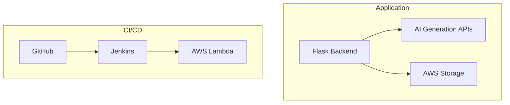

---

## Application Architecture

### High-Level System Diagram

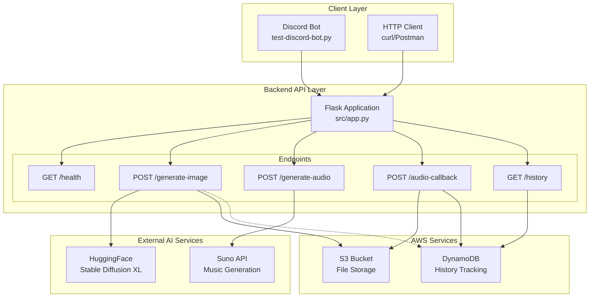

### Component Responsibilities

| Component | Responsibility |
|-----------|---------------|
| **Flask App** | Request routing, error handling, API orchestration |
| **HuggingFace API** | AI image generation using Stable Diffusion XL |
| **Suno API** | AI music generation (async with webhook) |
| **S3** | Store generated images and audio files |
| **DynamoDB** | Track generation history per user (optional) |

---

## Data Flow Diagrams

### Image Generation Flow

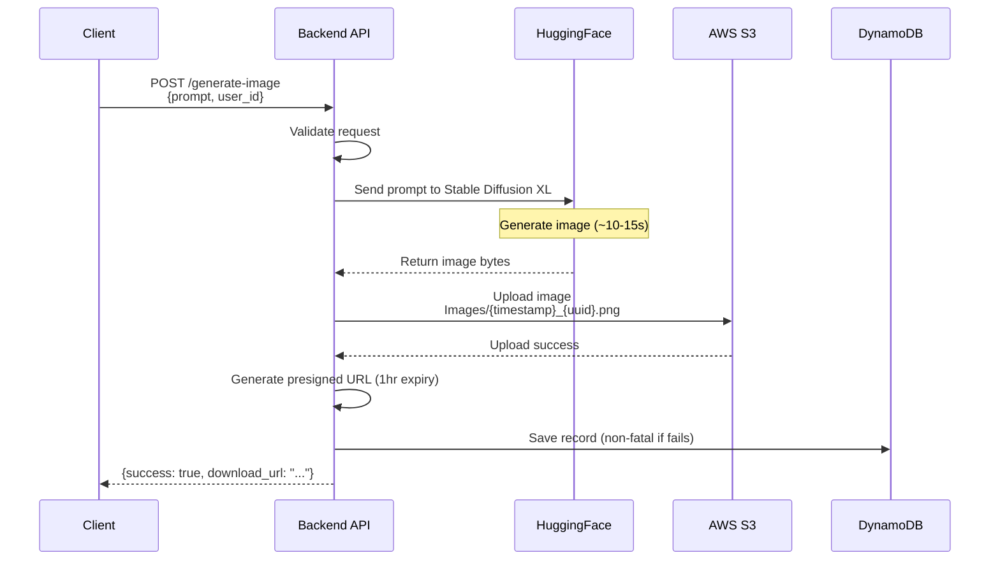

### Audio Generation Flow (Async)

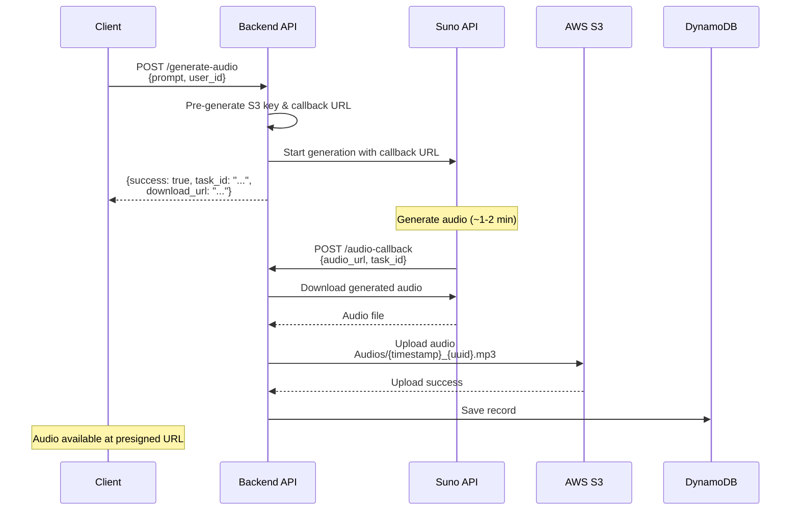

---

## CI/CD Pipeline Architecture

### Pipeline Overview

**Philosophy:** Prove → Codify → Automate

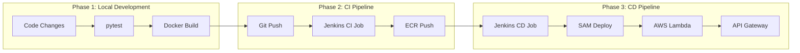

### CI Pipeline Stages

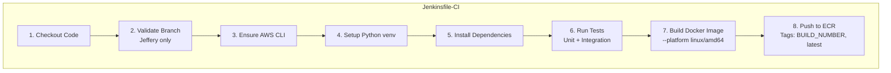

### CD Pipeline Stages

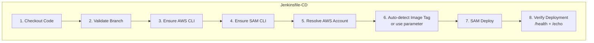

---

## AWS Infrastructure

### Deployed Resources

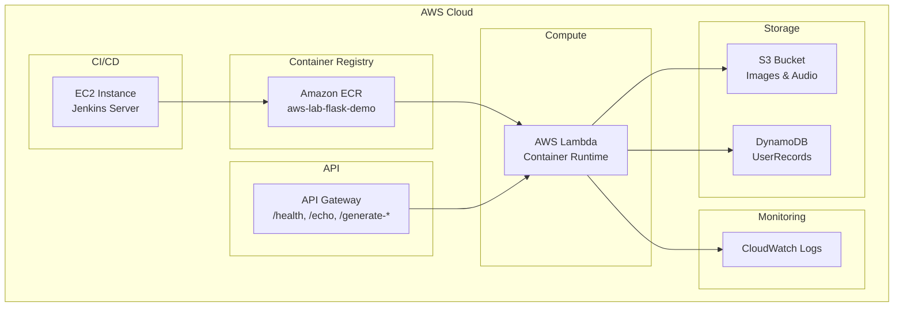

### AWS Services Explained

| Service | Description |
|---------|-------------|
| **Amazon ECR** | Elastic Container Registry - A fully managed Docker container registry that stores, manages, and deploys container images. We push our Flask application Docker images here for Lambda to pull. |
| **AWS Lambda** | Serverless compute service that runs code without provisioning servers. Our Flask app runs as a container-based Lambda function, scaling automatically with demand. |
| **API Gateway** | Managed service for creating and publishing APIs. Routes HTTP requests to Lambda functions, handling `/health`, `/generate-image`, `/generate-audio`, and `/history` endpoints. |
| **Amazon S3** | Simple Storage Service - Object storage for generated images and audio files. Provides presigned URLs for secure, time-limited file downloads. |
| **Amazon DynamoDB** | Fully managed NoSQL database. Stores user generation history with `user_id` as partition key and `record_id` as sort key. |
| **Amazon CloudWatch** | Monitoring and observability service. Collects Lambda logs, tracks metrics (invocations, errors, duration), and enables debugging. |
| **Amazon EC2** | Elastic Compute Cloud - Virtual servers in the cloud. Hosts our Jenkins CI/CD server for automated builds and deployments. |

### SAM Template Resources

| Resource | Type | Description |
|----------|------|-------------|
| `FlaskDemoFunction` | AWS::Serverless::Function | Lambda function using container image |
| `FlaskDemoApi` | AWS::Serverless::Api | API Gateway with /health and /echo endpoints |
| `LabRole` | (existing) | IAM role for Lambda execution |

### Network Flow

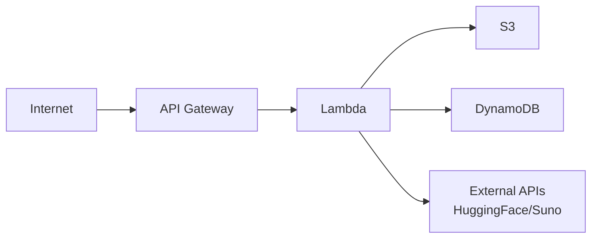

---

## Directory Structure Diagram

```
AWS_final_project/
├── backend/                    # Production AI Backend
│   ├── src/
│   │   ├── app.py             # Flask application
│   │   └── db.py              # DynamoDB helpers
│   └── tests/
│
├── demo-backend/               # CI/CD Validation Backend
│   ├── src/
│   │   └── app.py             # Simple Flask app
│   └── tests/
│
├── jenkins-pipeline-setting/   # Pipeline Definitions
│   ├── Jenkinsfile-CI         # CI pipeline
│   └── Jenkinsfile-CD         # CD pipeline
│
├── aws/                        # Infrastructure
│   ├── template.yaml          # SAM template
│   ├── samconfig-demo.toml    # Demo config
│   └── samconfig-prod.toml    # Prod config
│
├── scripts/                    # Automation
│   ├── local/                 # Local testing
│   └── jenkins/               # CI/CD scripts
│
└── docs/                       # Documentation
    ├── ARCHITECTURE.md        # This file
    ├── APPLICATION.md         # Backend docs
    └── CI_CD.md               # Pipeline docs
```

---

## Screenshots

### Jenkins Dashboard

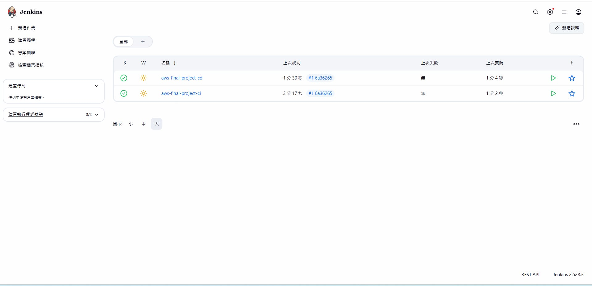

### CI/CD Pipelines

**CI Pipeline (Build & Push)**

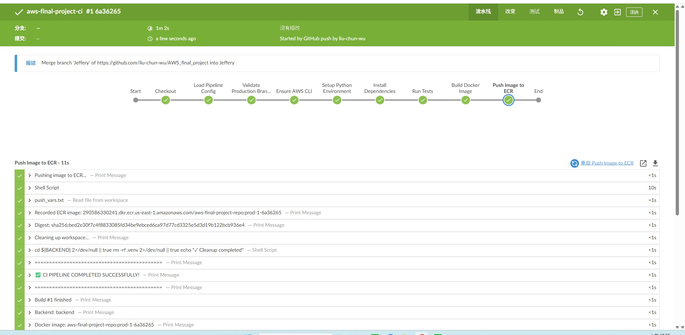

**CD Pipeline (Deploy & Verify)**

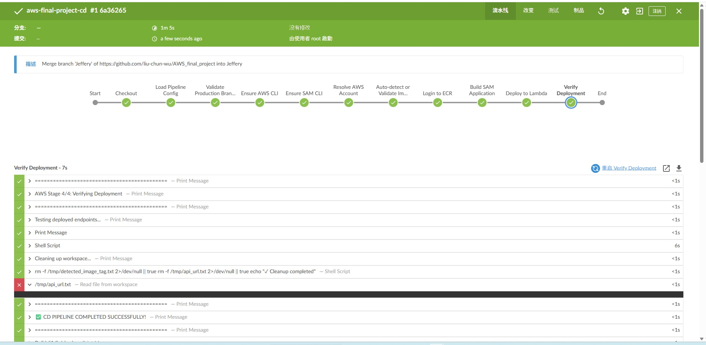

### AWS Infrastructure

**EC2 Instance (Jenkins Server)**

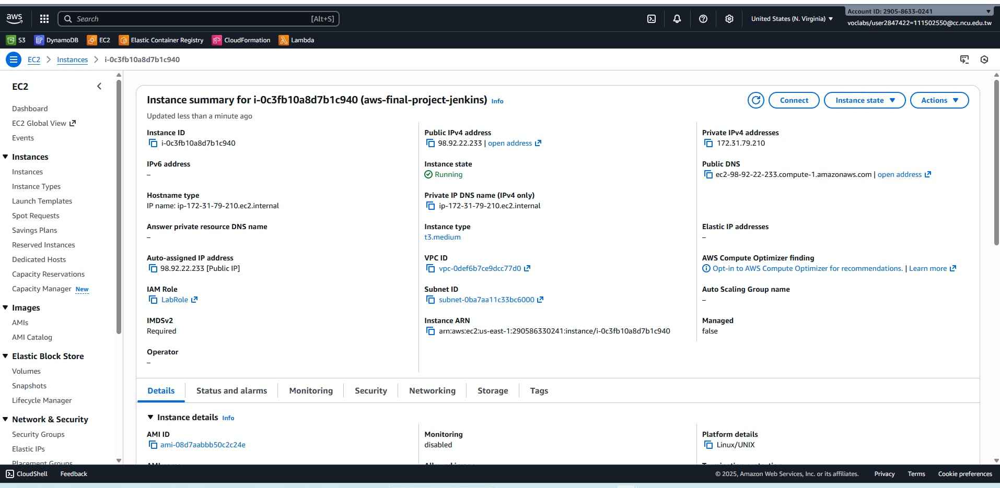

**ECR Repository (Container Images)**

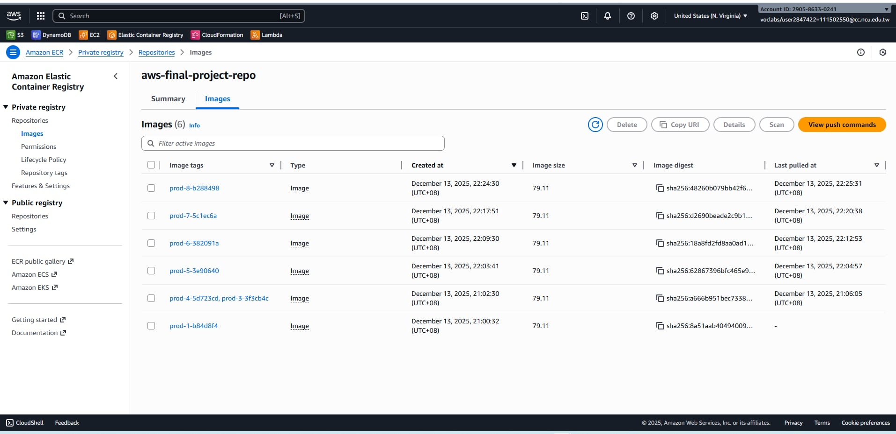

### Monitoring

**CloudWatch Dashboard**

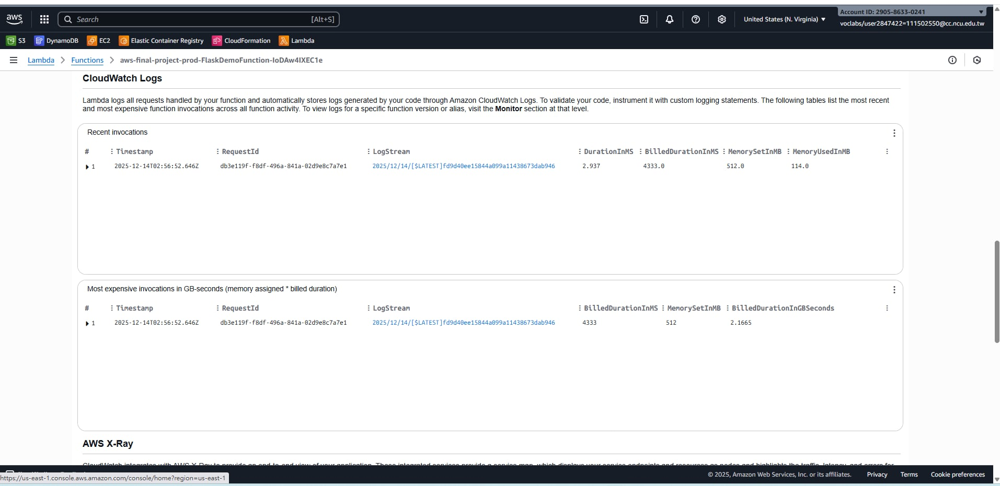

**CloudWatch Logs**


**CloudWatch Metrics**

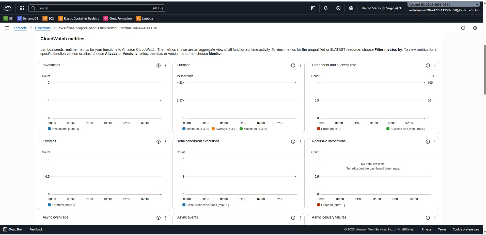

### GitHub Integration

**Webhook Configuration**

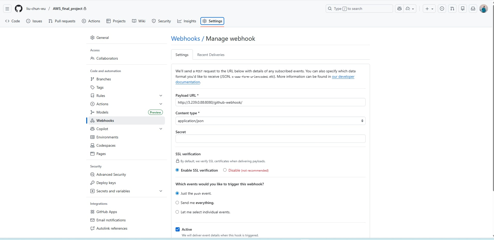

---

## See Also

- [Application Documentation](APPLICATION.md) - Detailed backend API docs
- [CI/CD Documentation](CI_CD.md) - Pipeline setup and usage
- [Quick Start Guide](QUICK_START.md) - Get started in 5 minutes
