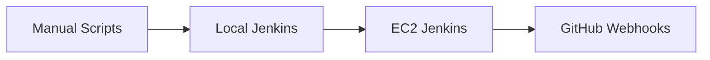
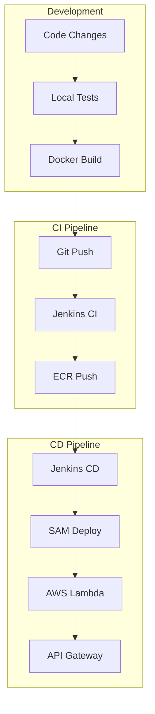
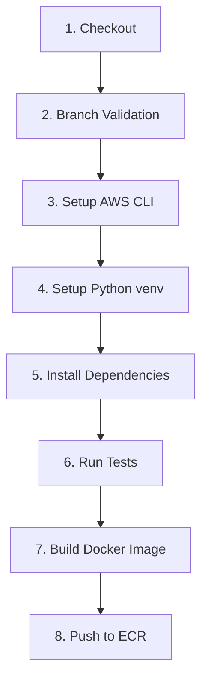
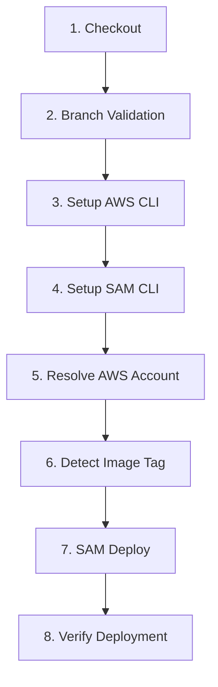

# CI/CD Pipeline Documentation

Complete guide to the CI/CD pipeline for automated testing, building, and deployment to AWS Lambda.

## Table of Contents

- [Overview](#overview)
- [Philosophy](#philosophy)
- [Pipeline Architecture](#pipeline-architecture)
- [Phase-by-Phase Guide](#phase-by-phase-guide)
- [Jenkins Setup](#jenkins-setup)
- [Branch Strategy](#branch-strategy)
- [AWS Deployment](#aws-deployment)
- [Scripts Reference](#scripts-reference)
- [Troubleshooting](#troubleshooting)

---

## Overview

This CI/CD pipeline automates the journey from code to production:

```
Code → Tests → Docker → ECR → Lambda → API Gateway
```

### Key Features

| Feature | Description |
|---------|-------------|
| **Automated Testing** | pytest runs on every push |
| **Container Build** | Docker images for AWS Lambda |
| **ECR Integration** | Images pushed to Amazon ECR |
| **SAM Deployment** | Infrastructure as Code |
| **Branch-Based** | Different behaviors per branch |
| **Webhook Triggers** | GitHub → Jenkins automation |

---

## Philosophy

### Prove → Codify → Automate

The implementation follows a progressive approach:

1. **Prove** - Test manually with scripts
2. **Codify** - Write Jenkinsfiles
3. **Automate** - Enable webhooks



**Why this approach?**
- Higher confidence at each step
- Easier debugging
- No "works in Jenkins but not locally" issues
- Rollback to manual if automation fails

---

## Pipeline Architecture

### CI/CD Flow



### CI Pipeline Stages



### CD Pipeline Stages



---

## Phase-by-Phase Guide

### Phase 1: Local Flask API

```bash
# Setup environment
cd backend
python3.11 -m venv .venv
source .venv/bin/activate
pip install -r requirements.txt

# Run locally
python src/app.py

# Test
curl http://localhost:8000/health
```

### Phase 2: Docker Containerization

```bash
# Build image
cd backend
docker build -t aws-lab-flask-demo:local .

# Run container
docker run --rm -p 8000:8000 aws-lab-flask-demo:local

# Test
curl http://localhost:8000/health
```

### Phase 3a: Manual CI (Tests + Build + Push)

```bash
# Run tests
./scripts/local/test-local.sh --prod

# Build and push to ECR
./scripts/jenkins/20-ci-build-and-push.sh --prod
```

### Phase 3b: Manual CD (Deploy + Verify)

```bash
# Validate SAM template
./scripts/jenkins/30-cd-validate-sam.sh --prod

# Deploy to Lambda
./scripts/jenkins/31-cd-deploy-sam.sh --prod

# Verify endpoints
./scripts/jenkins/32-cd-verify-deployment.sh --prod
```

### Phase 4: Local Jenkins

```bash
# Start Jenkins in Docker
./scripts/jenkins/40-setup-jenkins-local.sh

# Configure jobs
./scripts/jenkins/42-configure-jenkins-jobs.sh --local --demo
```

### Phase 5: EC2 Jenkins

```bash
# Provision Jenkins on EC2
./scripts/jenkins/41-setup-jenkins-ec2.sh --demo

# Configure jobs
./scripts/jenkins/42-configure-jenkins-jobs.sh --ec2 --demo
```

### Phase 6: Webhook Automation

1. Get Jenkins EC2 public URL
2. Configure GitHub webhook: `http://<jenkins-ip>:8080/github-webhook/`
3. Push to `Jeffery` branch
4. Watch CI run automatically

---

## Jenkins Setup

### Local Jenkins (Docker)

```bash
# Start Jenkins
./scripts/jenkins/40-setup-jenkins-local.sh

# Access Jenkins
open http://localhost:8080

# Get initial password
docker exec jenkins-local cat /var/jenkins_home/secrets/initialAdminPassword
```

### EC2 Jenkins

```bash
# Provision (default t3.medium)
./scripts/jenkins/41-setup-jenkins-ec2.sh --demo

# Check status
./scripts/jenkins/91-check-jenkins-status.sh

# Start/Stop (cost management)
./scripts/jenkins/93-start-jenkins-ec2.sh
./scripts/jenkins/94-stop-jenkins-ec2.sh
```

### Jenkins Jobs

| Job | Trigger | Description |
|-----|---------|-------------|
| `flask-ci` | Webhook (Jeffery branch) | Tests, builds, pushes to ECR |
| `flask-cd` | Manual | Deploys to Lambda via SAM |

### Job Parameters

**flask-ci:**
- `BACKEND_DIR`: `demo-backend` or `backend`

**flask-cd:**
- `BACKEND_DIR`: `demo-backend` or `backend`
- `IMAGE_TAG`: ECR tag (blank = auto-detect latest)

---

## Branch Strategy

### Jeffery Branch (Development)

| Stage | Trigger | Action |
|-------|---------|--------|
| CI | Auto (webhook) | Tests → Build → Push to ECR |
| CD | Manual | Deploy selected IMAGE_TAG |

### Workflow

```bash
# Daily development
git checkout Jeffery
# Make changes
./scripts/local/test-local.sh --prod
git add . && git commit -m "feat: new feature"
git push origin Jeffery
# CI runs automatically

# Ready to deploy
# Jenkins UI → flask-cd → Build with Parameters
# Select IMAGE_TAG from recent CI build
```

See [BRANCH_STRATEGY.md](../BRANCH_STRATEGY.md) for complete details.

---

## AWS Deployment

### AWS Services for CI/CD

The CI/CD pipeline uses the following AWS services:

#### Amazon ECR (Elastic Container Registry)

**Purpose:** Docker image storage and management

- Repository: `aws-lab-flask-demo`
- Stores versioned Docker images (tagged with build numbers)
- Integrated with Lambda for container deployment
- Lifecycle policies can auto-delete old images

**CI Pipeline Usage:**
```bash
# Login to ECR
aws ecr get-login-password | docker login --username AWS --password-stdin $ECR_URI

# Push image
docker push $ECR_URI:$BUILD_NUMBER
docker push $ECR_URI:latest
```

#### AWS Lambda (Container Runtime)

**Purpose:** Serverless execution of the Flask application

- Runs Docker containers from ECR
- No server management required
- Pay-per-request pricing
- Auto-scales with traffic
- 300s timeout for AI operations

#### Amazon API Gateway

**Purpose:** HTTP endpoint management

- Creates public URLs for Lambda functions
- Routes: `/health`, `/generate-image`, `/generate-audio`, `/history`
- Handles CORS, throttling, and request validation
- Provides the public API URL

#### Amazon CloudWatch

**Purpose:** Logging, monitoring, and debugging

- Automatic Lambda log collection
- Log groups: `/aws/lambda/{function-name}`
- Metrics: invocations, errors, duration, memory
- Useful for debugging deployment issues

**View Logs:**
```bash
aws logs tail /aws/lambda/flask-prod-backend-FlaskDemoFunction-xxx --follow
```

#### Amazon EC2

**Purpose:** Jenkins CI/CD server hosting

- Runs Jenkins for automated builds
- Receives GitHub webhook triggers
- Executes CI/CD pipeline scripts
- Must have Docker installed

### Required AWS Resources

| Resource | Purpose |
|----------|---------|
| ECR Repository | Docker image storage |
| Lambda Function | Runs containerized app |
| API Gateway | HTTP endpoints |
| S3 Bucket | Generated files |
| DynamoDB Table | History tracking (optional) |
| LabRole | IAM execution role |

### SAM Template

The `aws/template.yaml` defines:
- Lambda function (container image)
- API Gateway with routes
- Environment variables
- IAM role reference

### Deployment Commands

```bash
# First-time ECR setup
./scripts/jenkins/11-setup-ecr.sh

# Build and push
./scripts/jenkins/20-ci-build-and-push.sh --prod

# Deploy
./scripts/jenkins/31-cd-deploy-sam.sh --prod --image-tag latest

# Verify
./scripts/jenkins/32-cd-verify-deployment.sh --prod
```

### SAM Config Files

| File | Stack Name | Purpose |
|------|------------|---------|
| `samconfig-demo.toml` | flask-demo-backend | Demo/CI validation |
| `samconfig-prod.toml` | flask-prod-backend | Production |

---

## Scripts Reference

### Local Scripts (`scripts/local/`)

| Script | Purpose |
|--------|---------|
| `test-local.sh --prod\|--demo` | Run pytest suite |
| `build-local.sh --prod\|--demo` | Build Docker image locally |

### Jenkins Scripts (`scripts/jenkins/`)

| Script | Purpose |
|--------|---------|
| `11-setup-ecr.sh` | Create ECR repository |
| `20-ci-build-and-push.sh` | Full CI: test → build → push |
| `30-cd-validate-sam.sh` | Validate SAM template |
| `31-cd-deploy-sam.sh` | Deploy via SAM |
| `32-cd-verify-deployment.sh` | Test deployed endpoints |
| `40-setup-jenkins-local.sh` | Start local Jenkins |
| `41-setup-jenkins-ec2.sh` | Provision EC2 Jenkins |
| `42-configure-jenkins-jobs.sh` | Create Jenkins jobs |
| `91-check-jenkins-status.sh` | Check EC2 status |
| `93-start-jenkins-ec2.sh` | Start EC2 instance |
| `94-stop-jenkins-ec2.sh` | Stop EC2 instance |
| `99-cleanup-all.sh` | Delete all resources |

See [SCRIPTS.md](SCRIPTS.md) for detailed usage.

---

## Troubleshooting

### CI Pipeline Fails

**Symptoms:** Jenkins CI job fails

**Common Causes:**
1. Tests failing - check pytest output
2. Docker build error - check Dockerfile
3. ECR auth failed - refresh AWS credentials

```bash
# Run tests locally to debug
./scripts/local/test-local.sh --prod

# Check Docker build
docker build -t test:local backend/
```

### CD Pipeline Fails

**Symptoms:** SAM deploy fails

**Common Causes:**
1. Image tag not found in ECR
2. SAM template validation error
3. AWS credentials expired

```bash
# Validate SAM template
./scripts/jenkins/30-cd-validate-sam.sh --prod

# Check ECR images
aws ecr describe-images --repository-name aws-lab-flask-demo
```

### Webhook Not Triggering

**Symptoms:** Push doesn't start Jenkins build

**Check:**
1. GitHub webhook configured correctly
2. Jenkins EC2 is running
3. Security group allows port 8080
4. Branch filter matches (Jeffery)

### Lambda Timeout

**Symptoms:** API Gateway returns 502/504

**Solutions:**
1. Check Lambda timeout in SAM template
2. Check Gunicorn timeout in Dockerfile (300s)
3. Verify external API (HuggingFace) is responding

### AWS Credentials Expired

**Symptoms:** `ExpiredToken` error

**Solution:**
```bash
# Refresh from AWS Learner Lab
# Update ~/.aws/credentials
aws sts get-caller-identity  # Verify
```

See [TROUBLESHOOTING.md](TROUBLESHOOTING.md) for more solutions.

---

## Cost Management

### EC2 Jenkins

```bash
# Stop when not in use
./scripts/jenkins/94-stop-jenkins-ec2.sh

# Start when needed
./scripts/jenkins/93-start-jenkins-ec2.sh
```

### Cleanup Resources

```bash
# Delete everything (SAM stack + ECR)
./scripts/jenkins/99-cleanup-all.sh
```

### Cost Estimates

| Resource | Cost |
|----------|------|
| EC2 (t3.medium, stopped) | ~$0.03/day (EBS only) |
| EC2 (t3.medium, running) | ~$1/day |
| ECR | ~$0.10/GB/month |
| Lambda | Free tier |
| API Gateway | Free tier |

---

## See Also

- [Architecture Diagrams](ARCHITECTURE.md)
- [Application Documentation](APPLICATION.md)
- [Scripts Reference](SCRIPTS.md)
- [Testing Guide](TESTING.md)
- [Branch Strategy](../BRANCH_STRATEGY.md)
